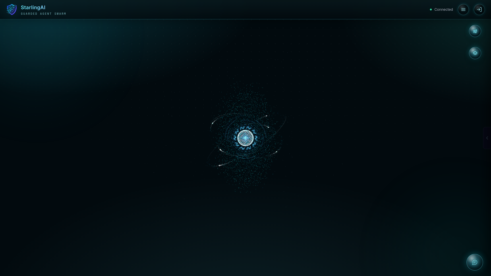
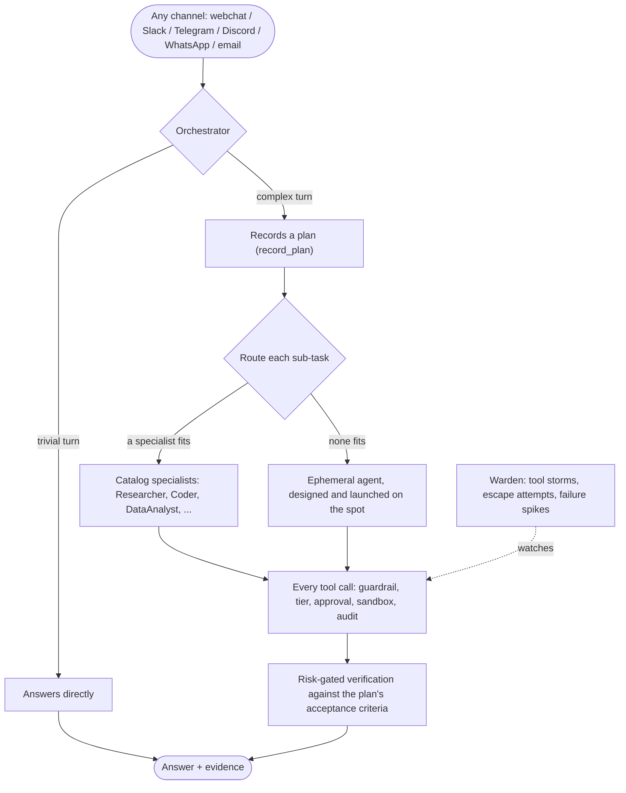
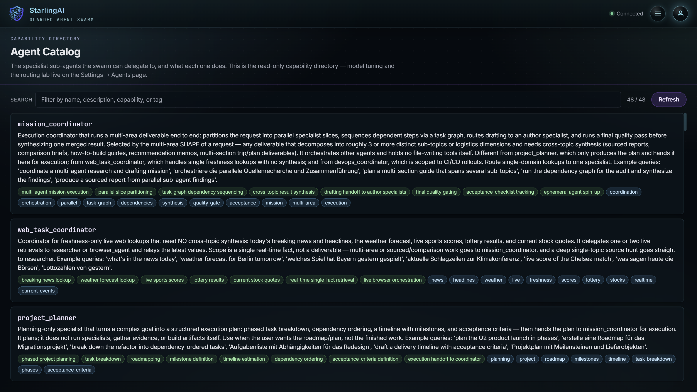
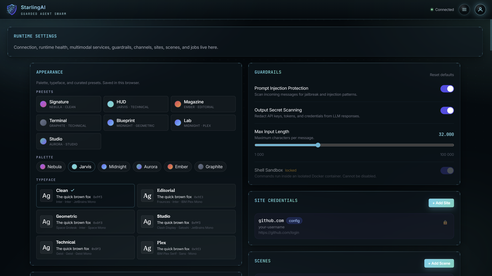
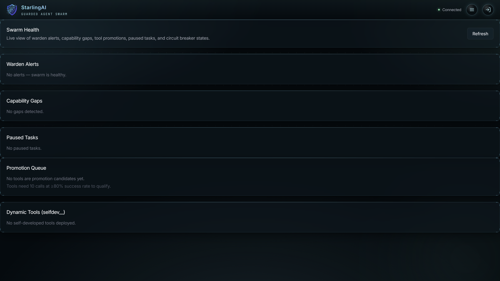

<div align="center">


# StarlingAI

**Thousands of starlings. Three local rules. No leader.<br/>And the flock outmaneuvers every hawk.**

[](LICENSE)
[](#quick-start)
[](docs/api.md)

[Quick Start](#quick-start) · [What it does](#what-the-swarm-can-do) · [Architecture](docs/architecture.md) · [API](docs/api.md) · [Security](docs/security.md)


<sub><em>The swarm at rest. Every particle is waiting for work — give it some.</em></sub>

</div>

---

Most agent frameworks build one big brain that owns every decision — then fails as one unit. StarlingAI is built like a **murmuration**: a thin orchestrator that decomposes the task, specialist agents that do scoped work in parallel — and when no existing specialist fits, the swarm **designs and launches a new one on the spot**. Underneath it all sit mechanically enforced guardrails that no amount of self-improvement is allowed to weaken.

The result is a general-purpose swarm that gets smarter the more it works — without ever getting more dangerous.

## How a task flies through the swarm

<div align="center">
<picture>
  <source media="(prefers-color-scheme: dark)" srcset="assets/diagrams/task-flow-dark.svg">
  
</picture>
</div>

<details>
<summary>Diagram source (mermaid)</summary>



Regenerate the SVGs from this source with mermaid (`theme: default | dark`, `flowchart.htmlLabels: false`) into `assets/diagrams/`.

</details>

Sub-tasks run **in parallel** over dependency-aware task graphs; delegation depth and width are hard-capped so a task can never cascade into a runaway fan-out.

| A murmuration of starlings… | …and its software twin |
| --- | --- |
| Each bird follows three local rules — avoid collision, match speed, stay close — reacting only to its ~7 nearest neighbors. | No master controller scripting every step. Agents operate on local contracts: load distribution, status exchange, cohesion as members fail or join. |
| From simple individual behavior emerges a fluid shape no single bird could produce. | Dynamically composed specialists solve tasks no single agent could handle alone. |
| A bird drops out; the flock closes the gap and flies on. | An agent fails; the runtime applies bounded fallback, keeps usable partial results, and reports honestly what's still incomplete. |

## Quick Start

> [!TIP]
> **The only prerequisite is [Docker](https://www.docker.com/products/docker-desktop/).** No Node, no pnpm, no config files to hand-edit — the guided setup runs inside Docker.

1. Install Docker and start it (wait for the whale to go green).
2. Download or clone StarlingAI, then **double-click the launcher**:
   - **Windows** — `start.bat`
   - **macOS** — `start.command` (first time: right-click → *Open*)
   - **Linux** — `./start.sh`

A guided wizard runs inside Docker, asks which model backend you want (an OpenAI-compatible endpoint you run, an Anthropic key, or a local model via Ollama that it pulls for you), builds the images, starts every service, and opens the dashboard already signed in. First run takes a few minutes; later starts are fast. Stop everything with `docker compose down`.

Then open:

| URL | What's there |
| --- | --- |
| `http://localhost:3001` | The dashboard — talk to the swarm |
| `http://localhost:3002` | Interactive setup tutorials |
| `http://localhost:8765` | The gateway API |

More detail (launcher internals, `sai start` flags, optional services): **[QUICKSTART.md](QUICKSTART.md)**.

<details>
<summary><strong>From source (developers)</strong></summary>

Full Node toolchain (Node 22 + pnpm):

```bash
git clone https://github.com/SteffenHebestreit/StarlingAI starlingai
cd starlingai
pnpm install
pnpm sai setup        # check prerequisites, generate .env secrets
pnpm sai start        # build config, build images, start services
```

Repo-local launchers work too: `./sai ...` in Bash/WSL, `./sai ...` / `.\sai ...` in Windows PowerShell.

```bash
pnpm sai start --rag               # include document-RAG stack (engram + reranker)
pnpm sai start --pentest           # include Kali Linux pentest service
pnpm sai start --computer-desktop  # include VNC desktop for computer-use
pnpm sai start --all               # all remaining optional services

pnpm sai stop                  # stop all services
pnpm sai stop --volumes        # stop + wipe all data
pnpm sai start --build         # force rebuild images
pnpm sai config build          # recompile config/ + workspace/ → starlingai.json
pnpm sai token                 # generate dashboard login JWT
pnpm sai health                # check service health endpoints
pnpm security:pack             # verify packed artifacts contain no .map or debug files
pnpm sai dev gateway           # start gateway in dev mode
pnpm sai dev web               # start web UI in dev mode
```

**Document RAG services.** `--rag` adds two containers: `engram` (graph-RAG API on the in-process `engramdb` backend — vector + BM25 + native-adjacency graph, no Neo4j) and `reranker` (GPU-first, CPU-fallback CrossEncoder sidecar serving `Qwen/Qwen3-Reranker-0.6B` in the TEI `/rerank` format). Both sit behind the `rag` compose profile, off by default — enable with `pnpm sai start --rag` or persist `SAI_ENABLE_RAG=1` in `.env`. The reranker downloads its model (~1.4 GB) on first start; `engram` points its embeddings + extraction LLM at the same primary model endpoint as the gateway (`SAI_PRIMARY_MODEL_URL`). See [`.env.example`](.env.example) for `ENGRAM_*` / `RERANKER_MODEL` overrides. The gateway degrades gracefully if these are absent.

</details>

## What the swarm can do

### 🧠 It thinks in parallel

<div align="center">

<br/><sub><em>The capability directory: 48 specialists and counting — each card is a bird in the flock.</em></sub>
</div>

- **Smart routing** — keyword, embedding, and outcome-based ranking picks the best specialist for each task; circuit breakers exclude agents that keep failing.
- **Ephemeral agents** — no specialist fits? The swarm architects and launches a purpose-built one. The good ones get promoted to the permanent catalog (behind holdout evidence and canary rollout).
- **Bounded fan-out** — independent sub-tasks run concurrently over dependency-aware task graphs with per-node fallbacks, but delegation depth and width are capped so one task can never cascade into a runaway swarm.
- **Plan-first on hard turns** — trivial asks get answered directly; complex ones get a recorded plan (`record_plan`) and a risk-gated verification pass before high-stakes answers ship.
- **Reusable workflows** — scenes and multi-step jobs are discoverable (`search_workflows`) and executable inline (`run_workflow`), so recurring work isn't replanned from scratch.

### 📚 It remembers and improves

- **Collective memory** — agents share facts and partial results through a semantic, embedding-backed memory layer. What one agent learns, all agents know.
- **Document RAG** — attached files are converted to Markdown and indexed into the [engram](https://github.com/SteffenHebestreit/engram) graph-RAG store; relevant excerpts are auto-retrieved per turn with cross-encoder reranking. Scoped to the conversation by default, extendable to user or workspace libraries.
- **Knowledge bases** — named corpora crawled from documentation sites (`create_knowledge_base`) by a bounded, robots-respecting, SSRF-guarded crawler, queried with `search_knowledge_base` — every excerpt cites its source URL. ([docs](docs/knowledge-bases.md))
- **Skill library** — agents author and refine reusable `SKILL.md` playbooks at runtime; a background distiller turns successful trajectories into discoverable procedures.
- **Bounded self-improvement** — the swarm may tune its own prompts, durable memory, sub-agent definitions, and approved tool assignments. It may **never** read secrets into model context or weaken a guardrail — self-improvement strengthens the flock's local rules, it doesn't replace the cage.

### 🌍 It reaches everywhere

- **Every channel** — webchat, Telegram, Slack, Discord, WhatsApp, and email, with delivery SLOs, dead-letter queues, and retry with backoff.
- **Multimodal tools** — speech-to-text, speech synthesis, image analysis, file-to-Markdown conversion, browser automation, shell execution, MCP, and webhooks — all behind the same gateway.
- **Server operations** — SSH, Docker, `systemctl`, and log triage route to shell/ops specialists with `ssh_exec`, not to desktop automation. A dedicated `computer-remote` sidecar keeps raw VNC/RDP/SSH sessions isolated from the gateway.
- **Open interoperability** — StarlingAI both *speaks and serves* the open agent protocols: an MCP server (HTTP + stdio) exposes its tools to other clients, and a public A2A server + client lets external agents collaborate with the swarm.
- **Federated swarms** — instances delegate work to each other over HMAC-signed, short-lived, peer-scoped tokens. Each side keeps its own tool tiers and approval gates — federation never bypasses local guardrails.
- **Plugin SDK** — trusted third-party tool packages extend the registry under a namespaced Tier-2 surface with tier-shadow rejection and per-call approval. (Plugin code currently runs in the gateway process and must be treated as trusted; digest trust and isolated execution are priority hardening items.)
- **Penetration testing** — a full Kali Linux toolchain (nmap, nikto, gobuster, sqlmap, hydra, wpscan, sslscan, ffuf, Metasploit, and more) wrapped in a scope-enforcing swarm with mandatory authorization.

### 🛡️ It stays guarded

<div align="center">

<br/><sub><em>Guardrails in the dashboard: prompt-injection scanning, output secret redaction — and a shell sandbox that is locked on. Some switches you don't get to flip.</em></sub>
</div>

- **Sandboxed by default** — sub-agents run containerized with `--cap-drop ALL`, a read-only root filesystem, bounded resources, and `network: none` unless the role requires approved access. Shell, script, test, and dynamic-tool execution get dedicated Docker sandboxes.
- **Every tool call gated** — guardrail → tier → approval → audit → output-redaction, on every registered invocation. No exceptions, including for the swarm's own self-improvement. ([tool tiers](docs/tool-tiers.md))
- **Credentials never enter the model** — agents inspect login metadata with `get_site_credentials`, but secrets are injected only through `site_fill_credentials` or `computer_type_credential`, under approval and audit.
- **Human-in-the-loop** — approval gates via Slack, outbound webhook, or sync webhook with one-click HTTP callbacks before sensitive actions proceed.
- **A warden on watch** — background monitoring detects tool storms, escape attempts, failure spikes, and SLO breaches in real time. (Its control state is process-local today; distributed observation and cancellation are planned before multi-worker scaling is treated as a hard guarantee.)

### 🔭 It stays watchable

<div align="center">

<br/><sub><em>Swarm Health: the warden's live view — alerts, capability gaps, tool promotions, paused tasks, circuit breakers.</em></sub>
</div>

- **Live observability** — token streaming to the dashboard via AG-UI SSE, live shell previews, per-turn performance telemetry, and audit/debug Markdown exports on top of a JSONL + PostgreSQL audit trail.
- **Distributed tracing** — OpenTelemetry spans cover tool calls, sub-agents, and federation hops, with W3C `traceparent` propagated across instances.
- **Cost governance** — token usage aggregated with per-model pricing and budget thresholds on a `/cost` dashboard. (Per-task limits are post-run signals today; atomic mission-wide budgets are on the roadmap.)
- **Multi-user access** — optional per-user accounts gate the dashboard and API; leave auth off and the single-user setup stays fully backwards compatible.

## The rules of the flock

Four objectives, one strict ordering — **security and authorization are invariants; quality defines done; robustness preserves the path to done; performance minimizes the cost of reaching it.**

| Goal | The promise | Never traded away |
| --- | --- | --- |
| **Guarded autonomy** | Tools, data, credentials, and outward actions stay inside explicit policy and approval boundaries. | No optimization or self-improvement may weaken the security contract. |
| **Quality** | Correct, complete, grounded results whose claims and artifacts can be checked. | No fast answer presented as verified when nothing was inspected. |
| **Robustness** | Progress survives timeouts, crashes, partial results, and worker loss; recovery happens in bounded, observable steps. | No infinite retries, silent task loss, or duplicate external effects. |
| **Performance** | The least model, tool, context, and wall-clock work that still meets the quality contract. | No blind fan-out or prompt growth that merely *looks* thorough. |

A change that improves one metric by silently weakening another is a regression, not an optimization.

> [!IMPORTANT]
> Effort dials, self-improvement, and federation can tune *quality and speed* — none of them can touch the security guardrails. The swarm may get smarter; it may not get more dangerous.

## Configuration — two zones, one hard wall

```
config/                  # Infrastructure — you set this up once. The agent CANNOT touch it.
  providers/             #   model backends (LM Studio, Ollama, Anthropic)
  gateway/               #   gateway port, guardrails, sandbox policy
  channels/              #   messaging (Telegram, Slack, Discord, …)
  multimodal/            #   STT, TTS, image generation service URLs
  integrations/          #   n8n, webhooks, sites, approval channels
  tooling/               #   retrieval, computer-use, pentest, MCP servers

workspace/               # Agent-tunable — the swarm self-improves here.
  agents/                #   agent definitions, sub-agent prompts & models
  jobs/                  #   operator-managed reusable job definitions
  scenes/                #   workflow / mission definitions
  runtime/               #   runtime.overrides.json (live config changes)
```

Within `workspace/`, only agent and scene definitions are mutable by the config-assistant; `workspace/jobs/` is operator-managed. Run `pnpm sai config build` to compile both zones into `starlingai.json` (the artifact Docker mounts). Details: [config/README.md](config/README.md) · [workspace/README.md](workspace/README.md).

Model wiring is environment-driven (the setup wizard writes `.env` for you): `SAI_PRIMARY_MODEL` pins the default agent model; `SAI_PRIMARY_MODEL_URL` / `SAI_PRIMARY_MODEL_KEY` point at any OpenAI-compatible server (LM Studio, Ollama, vLLM, llama.cpp, LocalAI, OpenRouter, or a remote box) or set `ANTHROPIC_API_KEY` for Claude; `SAI_MODEL_BACKEND=ollama` (with `SAI_OLLAMA_MODEL`) enables the bundled local-model overlay. Legacy `SAI_DEFAULT_MODEL` / `SAI_LMSTUDIO_URL` / `SAI_LMSTUDIO_API_KEY` names still work as aliases.

<details>
<summary><strong>Decision-flow controls</strong> (<code>orchestration.*</code>)</summary>

All optional, with sensible defaults — the orchestrator's flow is tunable without code edits:

| Key | Default | Effect |
| --- | --- | --- |
| `maxParallelSlices` | `2` | Max parallel cross-check slices a coordinator may fan out (raise for multi-GPU / API backends). |
| `maxDelegationDepth` | `3` | Max sub-agent nesting depth; deeper agents must use their own tools instead of delegating — bounds the tree. |
| `planFirst` | `true` | Nudge the orchestrator to record a structured plan (`record_plan`) before fanning out on a complex turn. |
| `riskGatedQA` | `true` | Auto-verify high-stakes answers (sourced claims, external actions) against the plan's acceptance criteria before shipping. |
| `planApproval` | `false` | Pause a high-risk or wide plan for human approval in the operator dock before executing it. |

</details>

<details>
<summary><strong>Effort tiers</strong> (<code>effort.*</code>)</summary>

A single per-session **effort** dial bundles the latency / budget / size / depth / reasoning knobs into named profiles — so a maximum-quality deliverable isn't cut short by guardrails tuned for fast local turns:

| Tier | Behavior |
| --- | --- |
| `low` | Fast & tight — short timeout, fewer iterations, no extended reasoning. |
| `medium` | Balanced default — zero overrides. |
| `high` | Thorough — long timeout, deeper delegation, full-length output, extended reasoning; **quality gates kept**. |
| `max` | Unbounded execution budget and strongest reasoning. Safety guardrails remain fixed; some correctness/QA gates are currently relaxed — a documented quality gap, not the target architecture. |

The tier is per session (persisted), seeded by `effort.default` (Settings → Agents → Orchestration Tuning, or the chat composer), and settable per message with `--effort low|medium|high|max` alongside `--auto`, `--iter N`, `--agent NAME`, and `--timeout N`. Per-tier profiles are tunable via `effort.profiles.<tier>` (built-ins in `runtime/effort-context.ts`). Effort never touches the content-safety/security guardrails — only orchestration quality/latency behavior.

</details>

<details>
<summary><strong>Internal domain / reverse proxy</strong> (HAProxy example)</summary>

For an internal domain behind HAProxy or another reverse proxy, publish the web entrypoint on port `3001` and route the domain to that service. The bundled Nginx layer already forwards `/api` and `/ws` to the gateway, so the browser stays same-origin and the dashboard auto-uses the current host for WebSocket and REST calls.

```haproxy
frontend starling_https
  bind *:443 ssl crt /etc/haproxy/certs/starlingai.pem
  acl host_starling hdr(host) -i ai.internal.example
  use_backend starling_web if host_starling

backend starling_web
  option http-server-close
  server starling 127.0.0.1:3001 check
```

If you expose the gateway directly on a separate origin instead, update the gateway CORS allowlist first.

</details>

## Repository layout

The root is reserved for entrypoints, compose files, top-level docs, and the compiled `starlingai.json` artifact — ad hoc scripts and generated reports don't live there.

```text
artifacts/              # Generated reports, exports, operator-collected artifacts
assets/                 # Brand assets and static imagery for docs/tutorials
scripts/                # Maintained CLI and support scripts
scripts/devtools/       # One-off maintenance and debugging helpers
config/                 # Protected infrastructure configuration
workspace/              # Durable workspace definitions and runtime overlays
.starlingai/            # Runtime state, logs, recordings, promoted agents
```

## Documentation

| Document | Purpose |
| --- | --- |
| [QUICKSTART.md](QUICKSTART.md) | Setup in depth: launchers, flags, optional services |
| [docs/architecture.md](docs/architecture.md) | System layout, swarm principles, runtime boundaries |
| [docs/api.md](docs/api.md) | REST, WebSocket, scene job, approval, and A2A interfaces |
| [docs/security.md](docs/security.md) | Auth, credential storage, sandboxing, audit behavior |
| [docs/tool-tiers.md](docs/tool-tiers.md) | Hard-coded tool permission tiers and approval rules |
| [docs/channels.md](docs/channels.md) | Channel capability matrix and delivery model |
| [docs/channel-setup.md](docs/channel-setup.md) | Channel onboarding walkthrough |
| [docs/knowledge-bases.md](docs/knowledge-bases.md) | Crawled corpora: crawler scope/safety, storage, retrieval |
| [docs/mail-service.md](docs/mail-service.md) | Headless mail-service architecture and API |
| [docs/forking.md](docs/forking.md) | Fork StarlingAI into a specialized swarm, stay rebase-clean |
| [CONTRIBUTING.md](CONTRIBUTING.md) | How to contribute |

After `pnpm sai start`, the **interactive tutorials** at `http://localhost:3002` cover setup guides, channel configuration, and agent details hands-on.

## Take it for a flight

- 🚀 **[One-click start](#quick-start)** — Docker, a double-click, and the orb is waiting for you at `localhost:3001`.
- ⭐ **Star the repo** if the murmuration idea resonates — it helps other people find the flock.
- 🔱 **[Fork it into your own specialized swarm](docs/forking.md)** — the fork guide keeps you rebase-clean with upstream.
- 🤝 **[Contribute](CONTRIBUTING.md)** — issues, docs, adapters, hardening: the flock grows one bird at a time.

## License

StarlingAI is **dual-licensed**:

- **Noncommercial use is free** under the [PolyForm Noncommercial License 1.0.0](https://polyformproject.org/licenses/noncommercial/1.0.0/) — personal, hobby, research, and educational use at no cost. Use it, modify it, share it for any noncommercial purpose (full terms in [`LICENSE`](LICENSE)).
- **Commercial use requires a paid license** — if StarlingAI touches revenue-generating activity, [contact the author](https://github.com/SteffenHebestreit/StarlingAI) for a commercial license.

Copyright © 2025–2026 Steffen Hebestreit.
