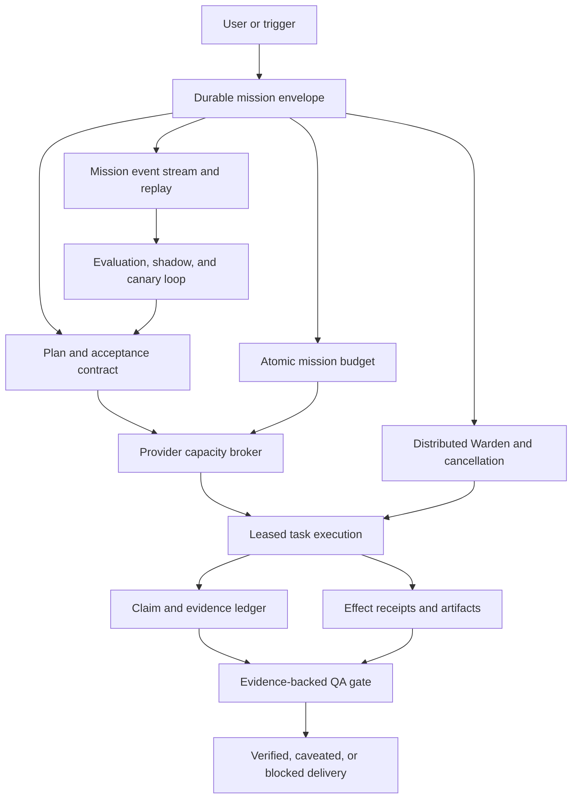
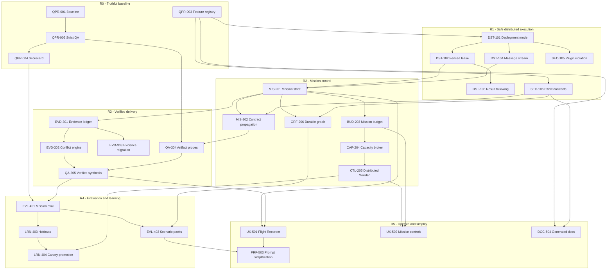

# StarlingAI Agent-Swarm Development Plan

**Date:** 2026-07-16  
**Scope:** swarm orchestration, reliability, security, memory, evaluation, observability, and self-improvement  
**Baseline:** StarlingAI v0.45.8 on `develop`, including the local Fable-method adoption work  
**Status:** R0–R3 implemented at slice-1 depth, adversarially reviewed, committed (`feat/dev-plan-r0-r3`), and live-validated in the rebuilt stack on 2026-07-17 (see the "Live validation" ledger row) — shadow-telemetry soak underway; R4/R5 in progress

## Executive decision

StarlingAI does not need more permanent agents first. It already has a broad specialist catalog, task graphs, parallel delegation, shared memory, Warden controls, container isolation, pass^k support, tracing, and cost accounting.

The highest-value next step is to turn the existing swarm from a collection of strong in-process mechanisms into a durable mission control plane. Mission ownership, budgets, evidence, side effects, cancellation, and quality gates need to be mechanically enforceable across gateway and worker processes. More prompt rules before that would add latency and maintenance cost while leaving the core failure modes intact.

The recommended sequence is:

1. Fix distributed claims, delivery, and containment.
2. Add a durable mission envelope with hard budgets and provider-aware admission control.
3. Replace untyped shared facts with a provenance-bearing evidence ledger.
4. Make QA evidence-backed and tri-state rather than fail-open.
5. Gate routing and self-improvement with mission-level evals and control cohorts.
6. Retire redundant prompt rules only after telemetry proves the underlying capability works.

## Philosophy alignment

The target control plane strengthens the README philosophy; it does not replace distributed intelligence with a central brain.

| Murmuration rule | StarlingAI interpretation | Development consequence |
| --- | --- | --- |
| **Avoid collision** | Do not let agents duplicate a task, overrun the same provider, or repeat an external effect. | Fenced leases, idempotency keys, effect receipts, and provider-aware admission are runtime rules, not prompt advice. |
| **Match speed** | Agents work within shared deadlines, budgets, and provider capacity instead of independently saturating the stack. | Mission budget inheritance, queue fairness, backpressure, wrap-up signals, and cancellation propagate through every child. |
| **Stay close** | Specialists remain aligned to one objective, acceptance contract, and evidence set without sharing unrestricted context. | Durable mission state, typed messages, claim/evidence links, and bounded context projections provide cohesion. |

The orchestrator remains thin: it decomposes, routes, and synthesizes. The mission store records what was agreed and observed; it does not decide how a specialist reasons. The capacity broker admits work; it does not choose the answer. The evidence ledger records claims and conflicts; it does not replace domain judgment. This separation keeps emergence while making failures observable and recoverable.

### Program decision rules

1. **Security and explicit authorization are invariant.** No performance, recovery, or self-improvement feature may bypass them.
2. **Quality defines completion.** Acceptance criteria, evidence, and artifact probes decide whether work is verified, caveated, partial, or failed.
3. **Robustness preserves progress.** Recovery reuses durable receipts and never blindly replays a side effect.
4. **Performance minimizes useful-work cost.** Optimize time to a quality result, not raw parallelism or tokens alone.
5. **Capability beats prompt accretion.** Implement enforceable state and tools before adding another incident-specific instruction.
6. **Aspirations and guarantees stay distinct.** Documentation calls a behavior distributed, durable, verified, or isolated only after its corresponding integration gate passes.

## What is already strong

The plan should preserve these implemented strengths rather than rebuild them:

- Bounded delegation depth, per-turn repetition caps, fallback routing, and anti-loop handling.
- Dependency-aware task graphs, parallel delegation, quorum synthesis, and disagreement detection.
- Session-scoped shared memory, durable session records, task checkpoints, and history compaction.
- Tool allowlists, hard-coded tiers, approval callbacks, secret redaction, workspace path guards, and Docker argument filtering.
- Warden anomaly detection, provider activity monitoring, recovery-net metrics, and OpenTelemetry spans.
- Pass^k-capable agent evaluation, scene evaluation, simulator tests, coverage-gated CI, and live runtime-guidance checks.
- Config and workspace shards, reusable scenes/jobs, procedural skills, and bounded self-authoring surfaces.

The audit found no failing focused subsystem tests: 142 QA, memory, budget, Warden, task-ledger, simulator, and evaluation tests passed. Package typechecks passed, and lint reported 0 errors. The findings below are design and enforcement gaps that the current tests often encode as expected behavior.

## Ranked findings

### P0 - Distributed task claims do not prevent duplicate work

**Evidence**

- `swarm/locks.ts:acquireTaskLock` defaults to a 30-second lease.
- `tools/sub-agent.ts:executeDelegationWithFallback` marks and announces a task as running before acquiring the lock.
- Execution continues when `acquireTaskLock` returns `null`.
- There is no lease renewal, while configured agents routinely run for 4 to 12 minutes.
- The Redis key contains only `taskId`; common ids such as `task_1` or graph node names can collide across sessions.

**Impact**

Two workers can execute the same expensive or side-effectful task. A healthy long run loses its lease after 30 seconds, and an unrelated session can contend on the same short task id. The feature is described as a distributed duplicate-execution guard, but it currently provides neither exclusion nor fencing.

**Include in StarlingAI**

- Introduce a lease key scoped by tenant, root session, mission, and structural task identity.
- Acquire before publishing `task_claimed` or mutating task state to running.
- Fail closed on contention and subscribe to the winning task's result instead of executing.
- Renew the lease while the worker is healthy; derive TTL from the effective child deadline.
- Return a monotonically increasing fencing token and reject stale completion writes.
- Make clustered mode fail readiness when Redis coordination is unavailable. Keep local fallback only for an explicit single-process mode.

**Acceptance gate**

- Two-process integration test: 100 simultaneous claims execute the task once.
- A task running longer than the initial TTL retains ownership.
- Killing the owner allows takeover only after lease expiry.
- Identical short task ids in different sessions never contend.
- A stale owner cannot publish completion after a new owner takes over.

### P0 - Agent messages can be lost during consume

**Evidence**

`swarm/memory.ts:consumeAgentMessages` performs `LRANGE`, filters in memory, deletes the full Redis list, and pushes unmatched messages back. Delivery is destructive before the receiving model processes the message, with no acknowledgement or retry.

**Impact**

Concurrent sends and consumes can overwrite one another. A worker crash after consume loses the message. Two consumers can both observe or remove the same entries. This weakens the swarm's collaboration channel precisely under load and failure.

**Include in StarlingAI**

- Replace the shared list with Redis Streams or per-recipient queues.
- Use consumer groups with claim, acknowledgement, visibility timeout, retry count, and dead-letter handling.
- Carry `missionId`, `taskId`, sender, recipient, correlation id, and an idempotency key.
- Acknowledge only after the message has been incorporated into a persisted turn/checkpoint.

**Acceptance gate**

- Concurrent producer/consumer test with no loss and no duplicate processing after idempotency filtering.
- Crash after claim causes redelivery.
- Poison messages move to a dead-letter stream after the retry ceiling.
- Backlog and oldest-message age are visible in readiness and the operator UI.

### P0 - Third-party plugins execute before approval containment

**Evidence**

- Plugins historically defaulted to enabled; the first containment change now defaults them to disabled pending isolation.
- `plugin/loader.ts` loads arbitrary JavaScript with native ESM `import()` inside the gateway process.
- Module-level code runs before plugin validation and before a tool invocation reaches the Tier-2 approval gate.
- Plugin tool handlers also execute in-process with gateway filesystem, environment, and network authority.

**Impact**

Per-call approval cannot contain import-time side effects or malicious package initialization. A compromised plugin is gateway code execution, including access to process secrets and internal networks.

**Include in StarlingAI**

- Default plugins to disabled until an operator explicitly trusts a source.
- Pin plugin identity by content digest and optional signature; store the approval receipt against that digest.
- Parse and validate a data-only manifest before loading executable code.
- Run plugin code in a separate worker process or container with a capability-scoped RPC surface.
- Mount no credentials or broad workspace by default; grant network and files per plugin manifest.
- Keep tool-tier approval in addition to, not instead of, load-time trust.

**Acceptance gate**

- A plugin with an import-time filesystem or network side effect cannot affect the gateway.
- Changing one byte invalidates the trust receipt.
- A plugin cannot read gateway environment secrets or call ungranted tools.
- Plugin crash, timeout, and memory exhaustion do not terminate the gateway.

### P1 - Swarm budgets are post-hoc labels, not budgets

**Evidence**

- `agents.budgets.*` defaults to zero, which disables every task budget.
- `finalizeAttemptBudget` evaluates limits only after a sub-agent finishes.
- Existing tests intentionally return a 1,500-token result against a 100-token cap and merely assert `budgetExceeded` afterward.
- Cost tracking and hard enforcement default off.
- There is no whole-mission token, tool, wall-time, or compute budget inherited by child agents.

**Impact**

The swarm can discover that it overspent but cannot prevent the spend. Retries and nested agents each receive fresh local allowances. Local models are priced at zero, so dollar budgets also miss the scarce resource: GPU time and queue occupancy.

**Include in StarlingAI: Mission Budget Envelope**

- Create a mission-level budget object persisted in Redis/Postgres.
- Track prompt tokens, completion tokens, tool calls, active compute time, wait time, monetary cost, and weighted GPU seconds.
- Reserve an estimated child budget before dispatch; reconcile against actual usage while streaming.
- Propagate remaining budget and deadline through every nested delegation and federation hop.
- Stop launching work when the remaining envelope cannot satisfy a minimum useful slice.
- Trigger a bounded wrap-up signal before a hard cutoff so partial evidence is delivered cleanly.
- Support operator policies: hard stop, ask to extend, downgrade model, reduce fan-out, or synthesize now.

**Acceptance gate**

- A mission never exceeds a configured hard token/tool/compute ceiling beyond one bounded in-flight chunk.
- Nested and parallel children debit the same atomic ledger.
- Cancellation returns useful partial evidence and releases reservations.
- Budget behavior remains correct across process restart and federation.

### P1 - Concurrency, Warden, and cancellation are process-local

**Evidence**

- `swarm/concurrency.ts` uses in-memory semaphores; the global limit is global only inside one Node process.
- Warden counters, alert rings, suppression state, and abort-controller registry are in memory.
- `registerSessionAbortController` can abort only a turn owned by the same process.
- Gateway and standalone scene-worker processes can run together and share the same providers.

**Impact**

Adding workers multiplies configured concurrency and anomaly thresholds. A Warden observing one process cannot stop work in another. Single-GPU protection currently relies heavily on a 10,178-character coordinator prompt telling the model to fan out exactly two tasks.

**Include in StarlingAI: Provider Capacity Broker**

- Add Redis-backed weighted semaphores per provider endpoint, model, GPU pool, agent class, and tenant.
- Estimate weight from model size, context/prefill, max output, and tool/container resource class.
- Support priority, fairness, deadlines, queue cancellation, and admission timeout.
- Publish Warden observations to a durable control stream and route abort commands to the owning worker.
- Persist ownership heartbeats so an operator can stop any mission from any gateway instance.
- Expose queue depth, utilization, wait p95, preemption, and rejected admissions.

**Acceptance gate**

- Two gateway/worker processes still honor one configured provider limit.
- A Warden alert in process A cancels a turn owned by process B.
- No queued request holds a per-agent slot while waiting indefinitely for a provider slot.
- Single-GPU overload scenarios complete without zero-iteration starvation.

### P1 - QA can certify malformed output without evidence

**Evidence**

- `qa-delivery-loop.ts:parseQaVerdict` treats empty or unparseable output as PASS.
- The deployment enables `qaDeliveryLoop` but leaves `qaEvidenceRequired` and `qaToolJudge` disabled.
- The default QA reviewer judges answer prose and cannot inspect produced files or served applications.
- QA runs only when a usable plan with acceptance criteria exists; plan creation remains soft.

**Impact**

A weak or confused reviewer can rubber-stamp an answer. A confident summary can pass while its artifact is truncated, internally inconsistent, or unreachable. The UI cannot distinguish verified, unverified, and not-run QA.

**Include in StarlingAI: Evidence-Backed Delivery Gate**

- Replace free-text parsing with a strict JSON schema and three states: `pass`, `fail`, `unverified`.
- Never convert malformed/empty output to `pass`; preserve availability by shipping as explicitly unverified when policy permits.
- Require evidence references for PASS: claim ids, artifact paths, probe ids, or test receipts.
- Enable a fresh-context, read-only tool judge for artifact-bearing turns.
- Verify served apps, parse structured files, check required sections, and run task-appropriate deterministic probes.
- Add plan-less consistency checks for substantive deliverables.
- Show the gate state and evidence in the final response metadata and operator UI.

**Acceptance gate**

- Empty, malformed, `REFUTED`, and bare PASS outputs cannot produce a verified status.
- A truncated HTML/JSON artifact and a dead served URL fail deterministic probes.
- A valid artifact passes with reproducible evidence references.
- Reviewer outage does not fabricate success; policy decides between caveated delivery and blocking.

### P1 - Shared facts are mutable strings, not an evidence ledger

**Evidence**

- `writeSharedFact` is a last-writer-wins Redis `HSET` by short key.
- Values are silently truncated at 2,000 characters.
- Automatic `FACT: key = value` extraction writes facts without source, observation time, task, or validation state.
- Rich `share_evidence` metadata exists, but downstream storage and synthesis still center on string facts.
- Current-turn fact tracking is an in-process map, so worker boundaries lose turn attribution.

**Impact**

Conflicting agents can overwrite each other. The synthesizer cannot reliably answer who observed a claim, from which source, when it was current, or whether another agent disputed it. Stale session facts can be mistaken for evidence gathered this turn.

**Include in StarlingAI: Claim and Evidence Ledger**

- Store append-only structured claims, not mutable key/value strings.
- Required fields: claim id, canonical subject, value, units, source reference, excerpt/hash, observed/retrieved time, agent, task, mission, confidence, validation state, and scope.
- Model `supports`, `contradicts`, `supersedes`, and `derived_from` relationships.
- Preserve raw evidence separately from a bounded prompt projection.
- Detect conflicts at write time and route material disagreement to verification.
- Make final citations refer to claim/evidence ids that can be replayed.
- Keep a compatibility projection for `read_shared_facts` during migration.

**Acceptance gate**

- Two conflicting values remain visible and trigger reconciliation; neither silently overwrites the other.
- Every factual final-answer span can be mapped to one or more evidence receipts.
- Prior-turn evidence cannot authorize a current-turn "verified" claim without explicit reuse metadata.
- Truncation affects only prompt projection, never the canonical record.

### P1 - Durable task-graph state is default-off and unsafe across writers

**Evidence**

- `durableTaskGraph` is disabled in the effective deployment.
- The ledger uses a read-modify-write JSON blob per session.
- Concurrent processes can lose one another's node completions.
- `writeTaskGraphLedgerBlob` slices serialized JSON at 64,000 characters; truncation can make the entire blob unparsable, and parsing then returns an empty ledger.

**Impact**

A retry after timeout can repeat expensive or side-effectful completed nodes. Enabling the current ledger in a multi-worker deployment risks lost completion records and total ledger reset.

**Include in StarlingAI**

- Persist one node receipt per Redis hash/SQL row with atomic compare-and-set.
- Store status transitions as events and derive current state from a materialized view.
- Declare node effect class: pure, idempotent, compensatable, or irreversible.
- Require idempotency keys and effect receipts before retrying mutation nodes.
- Resume incomplete graphs from durable state after restart.
- Never truncate serialized state; cap entries with explicit eviction and audit events.

**Acceptance gate**

- Parallel node completions from different processes are all retained.
- Restart at every graph transition resumes without repeating completed pure/idempotent nodes.
- An irreversible node is never automatically replayed without a verified effect receipt and policy decision.

### P1 - External side effects are not represented consistently by tool tiers

**Evidence**

- Config-generated `webhook__*` tools are Tier 1 with no mandatory per-call approval.
- Browser clicks, typing, and option selection are Tier 2 but deliberately do not require per-call approval unless a scene opts in.
- Some external writes are Tier 1 while similar calendar/contact operations require approval.
- Documentation still states broader approval guarantees than the code enforces.

**Impact**

A generic tier does not express destination, reversibility, data sensitivity, or business effect. A webhook may be a harmless local update or a production deployment trigger, yet both receive the same policy.

**Include in StarlingAI: Effect Contracts**

- Add tool metadata for effect domain, target resource, reversibility, data classification, idempotency, and compensation support.
- Evaluate approval policy from the resolved call, not only the tool name.
- Require explicit approval for external mutation by default; allow narrowly scoped standing grants with expiry and limits.
- Add dry-run/preview and effect receipts for webhook, browser submit, mail, calendar, infrastructure, and federation actions.
- Keep high-frequency local browser navigation ergonomic by distinguishing inspection from commit/submit actions.

**Acceptance gate**

- A webhook that can deploy cannot execute under an unscoped Tier-1 grant.
- Standing grants are resource-specific, time-bounded, revocable, and auditable.
- Retried side effects use idempotency keys or stop for operator resolution.

### P1 - Live quality evaluation is too narrow and mostly manual

**Evidence**

- CI strongly gates typecheck, lint, unit tests, coverage, build, config build, dependency audit, and secret scan.
- The root live agent plan currently contains two substring-judged Fable cases.
- A broader 12-case core plan exists, but it is smoke-oriented and not a CI/release gate.
- Scene eval has no pass^k, artifact inspection, pristine diff, or structured judge.
- Live runtime-guidance plans are manually repeated rather than natively aggregated.
- There is no committed StarlingAI eval-results baseline directory for the active deployment.

**Impact**

The project can prove component correctness but not reliably answer whether a full mission became more correct, cheaper, faster, safer, or less flaky after a prompt/model/flag change. Substring checks can pass on truthful-sounding but behaviorally wrong work.

**Include in StarlingAI: Mission Evaluation Lab**

- Unify agent, scene, runtime-guidance, and simulator plans under one report schema.
- Add pristine-workspace snapshot/diff checks and explicit side-effect assertions.
- Add deterministic artifact probes and optional rubric judges that receive ground truth plus observed tool/artifact evidence.
- Record pass^k, pass@k, calibration, completeness, grounded-claim precision/recall, side-effect violations, budget, latency, and recovery-net activations.
- Run a model/config matrix with immutable metadata: git SHA, generated-config digest, model ids, hardware profile, prompt digest, seed, and service versions.
- PR gate: deterministic simulators and security fixtures.
- Nightly gate: live routing, mission, RAG-isolation, chaos, and pass^k suites.
- Release gate: no P0 regression, reliability floor met, and baseline comparison reviewed.

**Initial scenario set**

- Multi-deliverable plan where every requested artifact must exist.
- Conflicting parallel researchers requiring reconciliation.
- Child timeout with useful partial evidence and parent wrap-up.
- Duplicate claim race across two workers.
- Worker crash during message delivery and task completion.
- Prompt injection in web/document/tool output attempting an external action.
- Unauthorized webhook/browser submit/deploy attempt.
- Cross-user RAG, memory, graph, and credential isolation.
- Cost/compute ceiling reached during nested fan-out.
- Fable traps: wrong test vs spec, missed twins, false completion, and unauthorized follow-up.

### P1 - Self-improvement promotes success without measuring causal lift

**Evidence**

- Skill auto-authoring and auto-promotion to scenes default on.
- Skills can graduate on their first successful real use.
- `holdoutRate` defaults to zero even though the schema documents holdouts as the way to separate skill lift from easy-task selection.
- Routing and outcome logs are observational and subject to selection bias.

**Impact**

The swarm can promote procedures that correlate with success but do not cause it, or that help easy matched tasks while harming hard ones. Autonomous changes can accumulate without a trustworthy counterfactual or rollback trigger.

**Include in StarlingAI: Shadow and Canary Learning**

- Require a minimum evidence window before promotion.
- Run matched holdout/control traffic and report confidence intervals, not raw success alone.
- Evaluate candidate prompts/skills/routes in shadow mode against recorded missions before activation.
- Canary by tenant/session cohort with automatic rollback on quality, safety, cost, or latency regression.
- Version every learned artifact with provenance, training missions, eval report, config digest, and rollback pointer.
- Keep autonomous promotion off for side-effectful scenes; require operator approval.

**Acceptance gate**

- No skill or route is promoted without measured positive lift and a minimum sample count.
- A harmful canary rolls back automatically and leaves an audit receipt.
- Evaluation prevents a learned artifact from using its own training missions as the only test set.

### P2 - Prompt and flag accretion is becoming a control-plane substitute

**Evidence**

- Prompt audit: 10 of 48 system prompts exceed the 2,500-character advisory threshold.
- `mission_coordinator` is 10,178 characters and embeds single-GPU scheduling, retry, artifact, research, and QA policy.
- `trustModelRouting` is defined in schema but has no runtime reference.
- The generated deployment enables `taskConditionalPrompt` despite documentation describing it as reverted/off.
- Documentation contains stale version/status and approval descriptions.
- Lint has 68 warnings, including unused assignments in QA, runtime, prompt, cost, and routing paths.

**Impact**

Long prompts increase prefill latency and bury critical rules. Dead or contradictory flags create false operator confidence. Recovery rules accrete after incidents instead of being retired when capabilities improve.

**Include in StarlingAI**

- Generate a feature registry from schema plus runtime usage and fail CI on dead public flags.
- Add config-drift CI: rebuild generated config and fail on unexpected diff.
- Move hardware scheduling to the capacity broker, evidence rules to the ledger/gate, and reusable procedures to skills/scenes.
- Track prompt section size, cache hit, prefill time, and instruction compliance per section.
- Use recovery-net activation metrics to nominate rules for deletion.
- Trim one prompt slice at a time behind pass^k A/B evaluation.
- Generate operator docs and effective/default status tables from schemas where possible.

**Acceptance gate**

- No public config key is dead or undocumented.
- Coordinator prompt is reduced substantially without mission-quality regression.
- Documentation's tier/approval tables are generated or tested against `getToolTier`.
- Lint warning count becomes a ratcheted CI metric and decreases monotonically.

### P2 - Multi-user isolation is not complete for untrusted tenants

**Evidence**

- User memory, user model, personality override, session state, and document RAG have meaningful tenant controls.
- Workspace memory and skills are intentionally shared.
- Unbound credentials/mail/compute resources are shared by design.
- Non-L0 graph operations and graph tools still use a shared instance graph.

**Impact**

The current model is suitable for trusted operators sharing a workspace, not arbitrary mutually untrusted tenants. A deployment can enable auth and overestimate the isolation it receives.

**Include in StarlingAI**

- Declare deployment modes: single operator, trusted team workspace, or untrusted multi-tenant.
- In untrusted mode, make resources private-by-default with explicit owner and grants.
- Add tenant and workspace to every graph node/edge and enforce them in all graph queries and caches.
- Make clustered fallback, plugin loading, shared skills, and workspace memory policies mode-aware.
- Add an automated isolation matrix to the release gate.

### P2 - Operators need mission replay, not only logs

**Evidence**

StarlingAI emits extensive audit events, spans, performance metrics, recovery-net counts, and computer recordings, but mission state is spread across transcript history, audit JSONL, Redis, task state, artifacts, and provider telemetry.

**Impact**

Incident analysis and eval authoring require manual reconstruction. It is difficult to answer why an agent was selected, which evidence supported a claim, where budget was spent, or what would resume after a crash.

**Include in StarlingAI: Swarm Flight Recorder**

- Persist a mission event stream with task, routing, budget, evidence, approval, artifact, and cancellation events.
- Build a deterministic timeline and DAG view from those events.
- Export a sanitized replay bundle with prompt/config/model digests and referenced artifacts.
- Support offline scripted replay with provider/tool stubs and fault injection.
- Link final answer spans to evidence and artifact receipts.

## Target architecture

## Delivery plan

### Phase 0 - Baseline and immediate truth fixes (1-2 weeks)

**Goals:** stop false guarantees, establish measurements, and unblock safe rollout.

1. Fix the current local root-layout integration by either moving the Fable plan/evals under allowed locations or intentionally adding their stable paths to the root allowlist.
2. Remove or wire `trustModelRouting`; add dead-flag failure to CI.
3. Treat the current `qaDeliveryLoop: true` deployment as experimental: until a committed pass^5 baseline exists, either disable it or label its result unverified. Add strict tri-state parsing behind a flag, then enable `qaEvidenceRequired` after pass^5 before restoring any verified status.
4. Generate a tool effect/approval inventory and reconcile security/tool-tier documentation with runtime truth.
5. Commit versioned baseline reports for deterministic simulators and the first live mission suite.
6. Add effective-config digest, model digest, and hardware profile to all eval reports.
7. Set `skillLibrary.holdoutRate` to a measured cohort (start at 0.15) or disable auto-promotion until enough control data exists.

**Exit criteria**

- Root `pnpm check`, lint, focused tests, build, and config build pass.
- No malformed QA output is labeled verified.
- No dead public feature flag remains.
- A reproducible baseline exists for at least 10 mission-level scenarios.

### Phase 1 - Distributed correctness and containment (2-4 weeks)

**Goals:** make multi-process execution safe before scaling it.

1. Implement namespaced renewable leases with fencing and result-following on contention.
2. Replace direct agent-message lists with acknowledged streams.
3. Add explicit single-process vs clustered coordination mode; fail readiness on unsafe clustered fallback.
4. Move plugins behind digest trust and an isolated runner; default them off until trusted.
5. Add effect contracts and mandatory policy for webhook, browser commit/submit, messaging, and infrastructure calls.
6. Add two-worker race, crash, and stale-owner integration tests using real Redis.

**Exit criteria**

- Duplicate-execution and message-loss chaos suites pass at least 100 repeated runs.
- A gateway or worker crash loses no acknowledged task result or message.
- Plugin import and invocation cannot access gateway secrets.
- External mutation always has an effect receipt and a valid grant/approval.

### Phase 2 - Mission control plane and hard resource governance (3-5 weeks)

**Goals:** make missions resumable, bounded, and schedulable.

1. Introduce `Mission`, `MissionTask`, `Attempt`, `BudgetReservation`, and `EffectReceipt` records.
2. Add the atomic mission budget envelope and child inheritance.
3. Implement provider/model/GPU weighted admission control across processes.
4. Distribute Warden state and cancellation commands.
5. Replace task-graph blobs with atomic node records and enable durable graphs after chaos pass^k.
6. Add pause, resume, cancel, extend-budget, and synthesize-now operator controls.

**Exit criteria**

- A mission resumes after gateway restart at every tested transition.
- Hard budgets and provider limits hold across multiple workers.
- Queue p95, compute utilization, useful-output rate, and cancellation latency are measurable.
- Mutation nodes obey idempotency/effect policy on retry.

### Phase 3 - Evidence and delivery integrity (3-5 weeks)

**Goals:** make every important claim and completion status reproducible.

1. Implement the append-only claim/evidence ledger and compatibility projection.
2. Migrate `share_evidence` to the canonical write path; mark raw `FACT:` extraction unverified/deprecated.
3. Add conflict detection, freshness, source authority, and turn/mission attribution.
4. Enable artifact-aware QA with deterministic probes and evidence-bearing verdicts.
5. Add final claim-to-evidence mapping and expose it in debug/audit export.
6. Enable short-answer, turn-scoped citation, gathered-evidence anchoring, partial-evidence honesty, and graph-failure flags only through focused pass^k gates.

**Exit criteria**

- Load-bearing factual claims achieve the agreed grounded precision/recall floor.
- Conflicting claims cannot silently collapse into one value.
- No artifact is marked verified without an inspectable receipt.
- Prior-turn evidence reuse is explicit and visible.

### Phase 4 - Evaluation and safe learning (3-6 weeks, then ongoing)

**Goals:** make changes prove their value before broad activation.

1. Ship the unified Mission Evaluation Lab and initial scenario matrix.
2. Add pristine diff, side-effect, artifact, and structured judge support.
3. Run nightly pass^k by model tier plus weekly chaos/load/isolation suites.
4. Add shadow routing, skill holdouts, canary cohorts, confidence intervals, and rollback.
5. Require an eval report and rollback pointer for every promoted skill, scene, prompt, route, and model preset.
6. Import the broader Fable trap set where it adds discriminating behavior, without duplicating its existing local roadmap.

**Exit criteria**

- Prompt/flag/model changes cannot merge without the appropriate regression suite.
- Auto-promotion is based on positive measured lift, not raw success rate.
- Null and negative experiments are retained beside wins.
- Release dashboard shows quality, reliability, cost/compute, safety, and latency deltas.

### Phase 5 - Simplification and operator experience (ongoing)

**Goals:** remove scaffolding made obsolete by capabilities and make missions understandable.

1. Build the Swarm Flight Recorder timeline/DAG, evidence viewer, budget view, and universal stop control.
2. Split the remaining orchestrator monolith into planning, execution, and synthesis prompts only where eval proves a gain.
3. Move hardware and retry policy out of prompts into the mission control plane.
4. Retire recovery nets with near-zero activation after their underlying capability is stable.
5. Ratchet lint warnings and prompt size budgets.
6. Generate effective configuration and security policy documentation from code.

**Exit criteria**

- A failed mission can be diagnosed and replayed from one bundle.
- Operator can explain every route, effect, claim, and stop reason.
- Prompt prefill and total model calls fall without lowering mission success.
- Recovery-net count trends down rather than growing indefinitely.

## Success metrics

Track these per mission class and model tier, not only as global averages:

| Dimension | Primary metric | Initial target |
| --- | --- | --- |
| Reliability | pass^k on release mission suite | >= 0.90 at k=5 for supported profiles |
| Completeness | acceptance criteria with evidence/artifact receipts | >= 0.95 |
| Grounding | load-bearing claims linked to valid evidence | >= 0.98 precision |
| Duplicate work | duplicate task executions per 1,000 claims | 0 |
| Message delivery | lost acknowledged agent messages | 0 |
| Budget control | hard-budget overshoot | <= one bounded stream chunk |
| Scheduling | provider queue wait p95 and zero-iteration failures | p95 within SLO; zero starvation |
| Safety | unauthorized external effects | 0 |
| Recovery | interrupted missions resumed without repeated completed work | >= 0.99 |
| Learning | promoted changes with positive holdout lift | 100% |
| Explainability | final claims/effects/routes with receipts | >= 0.95 |

Targets should be calibrated from the Phase-0 baseline before becoming release blockers.

## Ownership map

| Workstream | Primary modules |
| --- | --- |
| Mission state and leases | `swarm/locks.ts`, `tools/sub-agent.ts`, new `swarm/mission-store.ts` |
| Reliable messaging | `swarm/memory.ts`, `tools/memory.ts`, swarm bus |
| Budget and scheduling | `agent/sub-agent.ts`, `runtime/effort-context.ts`, `observability/cost.ts`, new capacity broker |
| Distributed Warden | `agent/warden.ts`, audit/swarm bus, gateway/worker lifecycle |
| Evidence ledger | `tools/memory.ts`, `swarm/memory.ts`, `agent/evidence-*`, graph/vector stores |
| QA gate | `agent/qa-delivery-loop.ts`, `agent/qa-tool-judge.ts`, `agent/turn-finalize-guards.ts` |
| Effects and plugins | `guardrails/tool-tiers.ts`, `tools/registry.ts`, `plugin/loader.ts`, approval system |
| Evaluation | `agent/evaluation.ts`, `agent/scene-evaluation.ts`, runtime-guidance harness, `tests/swarm-simulator.test.ts` |
| Operator UX and replay | audit, tracing, gateway observability routes, web mission views |

## Canonical control-plane data model

The first architecture decision record should settle storage, but every implementation must preserve this logical model. Identifiers are opaque UUIDs; every mutable transition carries a version or fencing token.

| Entity | Required fields | Purpose and invariant |
| --- | --- | --- |
| `Mission` | `id`, tenant/user/workspace scope, root session, objective, status, contract version, config/model/prompt digests, created/updated timestamps | Durable root of one user-visible objective. Status changes only through mission events. |
| `MissionContract` | acceptance criteria, stop conditions, allowed agents/tools/effects, quality policy, deadline, budget policy | Data representation of done and permitted work. Child contracts may narrow but never widen it silently. |
| `MissionTask` | `id`, mission id, structural signature, title, dependencies, effect class, idempotency key, status | Stable unit of work. The signature identifies equivalent work; task id identifies this planned node. |
| `Attempt` | `id`, task id, worker id, lease/fencing token, agent/model/provider, start/end, terminal state, usage, result refs | One execution of a task. Only the current fencing token may publish a terminal transition. |
| `BudgetAccount` | limits, reserved, spent, released, policy, version | Atomic mission resource ledger. Every child reserves before launch and reconciles while streaming. |
| `MessageEnvelope` | id, mission/task ids, sender, recipient, type, payload ref, idempotency key, delivery state, retry count | Acknowledged agent coordination. Delivery is at-least-once; processing is idempotent. |
| `EvidenceClaim` | claim id, subject/value/units, source ref, excerpt/hash, observed time, agent/task/mission, confidence, validation state | Append-only factual claim. Conflicts coexist and are linked rather than overwritten. |
| `ArtifactReceipt` | artifact id, content hash, path/URL, producer attempt, media type, probe results | Proof that a deliverable exists and what was inspected. |
| `EffectReceipt` | effect id, tool, normalized target, request/idempotency hash, approval/grant, start/outcome, compensation ref | Proof of an outward action or an explicitly unresolved outcome. |
| `MissionEvent` | sequence, mission id, type, actor, timestamp, payload/ref, trace context | Append-only source for replay, audit, projections, and distributed control. |

### Storage responsibility

- **PostgreSQL** is the durable system of record for missions, tasks, attempts, contracts, receipts, and materialized status when configured.
- **Redis** provides leases, budget atomics, queues/streams, short-lived coordination, and fast projections. It is not the only copy of terminal mission history.
- **Object/workspace storage** holds artifacts and large raw evidence by content hash. Database records carry references and integrity hashes.
- **Audit and tracing** remain append-only observation streams and correlate to mission events; they are not used as the sole transactional store.
- **Single-process mode** may use a documented local adapter for development. Clustered mode fails readiness when required coordination/durability services are unavailable; it never silently degrades to unsafe local semantics.

### Transition invariants

- A task moves to `running` only after a lease and budget reservation succeed.
- A completion is accepted only from the current fencing token.
- A message is acknowledged only after its effect on durable task/turn state commits.
- A budget reservation is released or reconciled on every terminal path, including cancellation and crash recovery.
- A side-effectful attempt without a terminal receipt becomes `outcome_unknown`, never automatically retried.
- A `verified` mission result references evidence and/or artifact probe receipts. Malformed QA can produce only `unverified`.

## Detailed work breakdown

The IDs below are stable planning handles. Each package should land as one reviewable PR or a small PR series behind a default-off flag.

### Release R0 - Truthful baseline and quality contract

| ID | Deliverable | Key implementation | Dependencies | Definition of done |
| --- | --- | --- | --- | --- |
| `QPR-001` | Repository and eval baseline integration | Place/allow stable Fable eval assets, create versioned result location, record git/config/model/prompt/hardware digests | none | Root CI passes; at least 10 mission scenarios have reproducible baseline metadata and raw results. |
| `QPR-002` | Strict tri-state QA contract | Structured `pass/fail/unverified` response, strict parser, evidence references, migration of audit/UI status | `QPR-001` | Empty, malformed, bare-PASS, and reviewer outage never emit verified; legacy mode covered by compatibility tests. |
| `QPR-003` | Effective feature registry | Generate schema/default/effective/read-site inventory; remove or wire `trustModelRouting`; detect docs/runtime drift | none | CI fails on dead public flags and stale generated policy tables; effective settings are exportable. |
| `QPR-004` | Quality scorecard v2 | Criteria coverage, evidence count, artifact probe status, QA state, partial/failure reason in one event | `QPR-002` | Every terminal turn emits exactly one scorecard; dashboard and eval consume the same schema. |

### Release R1 - Safe distributed execution

| ID | Deliverable | Key implementation | Dependencies | Definition of done |
| --- | --- | --- | --- | --- |
| `DST-101` | Explicit deployment mode | `single_process`, `trusted_cluster`, `untrusted_multi_tenant`; dependency/readiness policy per mode | `QPR-003` | Cluster mode refuses unsafe Redis/DB fallback; status endpoint explains every degraded dependency. |
| `DST-102` | Renewable namespaced task lease | Scope key by tenant/workspace/mission/task signature; acquire-before-claim; heartbeat renewal; fencing sequence | `DST-101` | Two workers execute 100 contended tasks once; lease survives long work; stale owner completion is rejected. |
| `DST-103` | Result following and takeover | Contender waits on durable task event; owner loss moves task to recoverable state; takeover policy | `DST-102` | Contender receives winning result without duplicate inference; takeover occurs only after expiry and policy check. |
| `DST-104` | Acknowledged agent messaging | Redis Streams consumer groups, per-recipient routing, ack, visibility timeout, retry, dead letter, idempotency | `DST-101` | Producer/consumer concurrency and crash tests show zero lost acknowledged messages and bounded duplicate processing. |
| `SEC-105` | Plugin trust and isolation | Data-only manifest, digest/signature receipt, default-off untrusted load, isolated worker/container RPC, capability grants | `DST-101` | Import-time code cannot affect gateway, read secrets, or access ungranted network/files; digest change revokes trust. |
| `SEC-106` | Effect contracts | Effect classification, normalized targets, scoped grants, dry run, idempotency and compensation metadata, receipts | `QPR-003` | Webhook/browser-submit/mail/infra tests prove every external mutation has policy and a terminal or unknown-outcome receipt. |

### Release R2 - Durable mission control and resource governance

| ID | Deliverable | Key implementation | Dependencies | Definition of done |
| --- | --- | --- | --- | --- |
| `MIS-201` | Mission store and event stream | Versioned entities above, transactional event append + projection, session compatibility adapter | `DST-102`, `DST-104` | Mission can be reconstructed from events; restart at each transition preserves status and references. |
| `MIS-202` | Mission contract propagation | Root contract creation, child narrowing, acceptance/stop/effect policy propagation through delegation/workflow/federation | `MIS-201`, `SEC-106` | Every attempt links to the effective contract; no child widens tools, effects, deadline, or budget silently. |
| `BUD-203` | Atomic mission budget | Reserve/reconcile/release token, tool, active-time, cost, and weighted-compute accounts; wrap-up threshold | `MIS-201` | Parallel/nested/federated tests hold one hard envelope with bounded overshoot and useful partial delivery. |
| `CAP-204` | Provider capacity broker | Weighted Redis semaphore by endpoint/model/GPU pool; priority, fairness, deadline, cancellation, admission timeout | `MIS-201`, `BUD-203` | Two processes honor one provider cap; no zero-iteration starvation; queue and utilization metrics meet calibrated SLOs. |
| `CTL-205` | Distributed Warden control | Durable alerts/commands, owner heartbeat, remote abort, cooldown/dedup, universal operator stop | `MIS-201`, `CAP-204` | Process A stops work in B within cancellation SLO; command is idempotent and leaves a terminal mission event. |
| `GRF-206` | Atomic resumable task graph | Per-node rows/events, CAS transitions, effect class, durable dependency projection, restart scheduler | `MIS-201`, `SEC-106` | Crash at every graph transition resumes without losing nodes or replaying completed/unknown effects. |

### Release R3 - Evidence and verified delivery

| ID | Deliverable | Key implementation | Dependencies | Definition of done |
| --- | --- | --- | --- | --- |
| `EVD-301` | Canonical evidence ledger | Append-only claim/source schema, large evidence refs, mission/turn attribution, compatibility shared-facts projection | `MIS-201` | Canonical evidence is never silently truncated; old readers continue through the bounded projection. |
| `EVD-302` | Conflict and freshness engine | `supports/contradicts/supersedes/derived_from`, unit normalization, source authority, observed/effective dates | `EVD-301` | Conflicting values remain visible and material conflicts create verification work instead of last-writer-wins. |
| `EVD-303` | Evidence migration | Dual-write `share_evidence`, mark raw `FACT:` extraction unverified, backfill existing curated records, telemetry | `EVD-301` | Shadow comparison shows parity; rollback to legacy reads is possible until two stable releases pass. |
| `QA-304` | Deterministic artifact probe framework | Probe registry by media/effect type; HTML/JSON parse, required sections, hash, served health/log scan, test receipt | `QPR-002`, `MIS-202` | Broken/truncated/dead artifacts fail; valid artifacts pass with reproducible receipts and bounded probe time. |
| `QA-305` | Evidence-backed synthesis and answer map | Claim-to-answer references, acceptance coverage, strict QA input, user/debug receipt view | `EVD-302`, `QA-304` | Load-bearing claims meet calibrated grounding target; verified output has no unsupported criterion or artifact claim. |

### Release R4 - Mission evaluation and safe learning

| ID | Deliverable | Key implementation | Dependencies | Definition of done |
| --- | --- | --- | --- | --- |
| `EVL-401` | Unified mission eval schema | Merge agent/scene/runtime/simulator reports; pristine diff, artifacts, effects, receipts, pass^k, environment health | `QPR-004`, `QA-305` | One CLI/report format evaluates all mission types and rejects environment-suspect runs. |
| `EVL-402` | Scenario and chaos packs | Quality, race, crash, budget, injection, isolation, conflicting evidence, side-effect, and Fable trap packs | `EVL-401`, `GRF-206` | PR deterministic suite, nightly live suite, and weekly chaos/load suite publish comparable results. |
| `LRN-403` | Shadow and holdout framework | Matched controls, assignment persistence, contamination guard, confidence interval, minimum samples | `EVL-401` | Skill/route/prompt candidates report measured lift with no training/eval overlap. |
| `LRN-404` | Canary promotion and rollback | Versioned candidate, cohort rollout, quality/safety/performance guardrails, automatic rollback, audit receipt | `LRN-403`, `CTL-205` | Harmful canary rolls back automatically; no learned artifact promotes without positive lift and rollback pointer. |

### Release R5 - Operator control and simplification

| ID | Deliverable | Key implementation | Dependencies | Definition of done |
| --- | --- | --- | --- | --- |
| `UX-501` | Swarm Flight Recorder | Mission timeline/DAG, route rationale, budget, evidence, approvals, effects, artifacts, sanitized replay export | `MIS-201`, `QA-305` | Operator can answer who/what/why/when/cost/evidence from one view and replay bundle. |
| `UX-502` | Mission controls | Pause, resume, cancel, extend budget, synthesize now, reconcile unknown effect | `CTL-205`, `BUD-203` | Every control is authorized, idempotent, reflected in UI, and tested across owner process loss. |
| `PRF-503` | Prompt/control-plane simplification | Move scheduling, evidence, retry, and completion policy out of prompts; split stage prompts; recovery-net retirement | `EVL-402`, `UX-501` | Coordinator prompt/prefill and model calls decrease with no pass^k, safety, completeness, or recovery regression. |
| `DOC-504` | Generated architecture/policy reference | Generate effective flags, tool effects/approvals, deployment-mode guarantees, metric definitions | `QPR-003`, `SEC-106` | README/architecture/security tables are checked against runtime metadata in CI. |

### Dependency graph and release gates

Arrows mean "must be sufficiently complete before." Packages within a release may run in parallel when their incoming dependencies are satisfied.

| Release | Promotion gate | Rollback checkpoint |
| --- | --- | --- |
| `R0` | Reproducible baseline exists; strict QA produces no false verified status in deterministic and live pass^5 suites. | QA compatibility flag and stored baseline report. |
| `R1` | 100-run contention/crash/message suites pass; plugin and effect isolation suites pass. | Legacy dispatch/message read flags; no new-format data deleted. |
| `R2` | Restart matrix, hard-budget, capacity, remote-cancel, and graph effect tests pass in two-process mode. | Mission projection can return to legacy reads; event log remains authoritative. |
| `R3` | Evidence migration parity and artifact probes pass; grounded precision/criteria coverage meet calibrated targets. | Legacy evidence projection/read remains available for two releases. |
| `R4` | Scenario packs are stable; holdout assignment and automatic canary rollback are proven with an injected regression. | Candidate versions and cohort assignment permit immediate prior-version restoration. |
| `R5` | Replay bundle diagnoses sampled failures; prompt reduction improves useful-work cost without quality/robustness loss. | Restore prior prompts/control defaults by digest; retain generated diagnostics. |

## Compatibility and migration strategy

Every stateful replacement follows an additive migration. Destructive flag days are explicitly out of scope.

1. **Introduce versioned schemas and write adapters.** Existing session/task APIs remain the caller surface.
2. **Dual-write behind a flag.** Emit legacy state and new mission/evidence/events together; compare counts, hashes, and terminal outcomes.
3. **Shadow-read and audit differences.** New readers compute results without controlling execution. Any divergence gets a diagnostic event and blocks rollout.
4. **Backfill bounded durable history.** Backfill only records needed for active sessions and agreed retention; preserve source ids and timestamps.
5. **Canary reads by cohort.** Start with internal sessions, then trusted operators, then the default deployment mode.
6. **Keep an immediate read fallback.** A runtime switch returns to legacy reads without deleting new data.
7. **Stop legacy writes after two stable releases.** Remove old storage only after rollback windows, migration metrics, and release evals are clean.

### Required migration telemetry

- Legacy/new write success and latency.
- Projection mismatch count by entity and field.
- Events without materialized state and state without source event.
- Lease, budget, message, evidence, and effect records orphaned past their recovery window.
- Backfill progress, rejected records, and storage growth.

## Test and verification matrix

New proposed commands should be added as package scripts when their harness lands; until then, run the underlying Vitest/integration entrypoints directly.

| Layer | Purpose | Required cases | Gate |
| --- | --- | --- | --- |
| Unit | Pure transition, parser, budget, lease, conflict, and policy functions | boundary values, malformed input, cancellation, idempotent repeats | Every PR |
| Component | Store/queue/worker behavior with real Redis/Postgres containers | CAS, stream ack/redelivery, reservation atomics, schema migration | Every stateful PR |
| Two-process integration | Prove claims that cannot be tested in one process | lease contention, distributed cap, remote cancel, concurrent node completion | R1/R2 merge gate |
| Chaos | Kill gateway/worker/Redis connection at each transition | owner loss, message claim, effect timeout, graph completion, budget reconciliation | Nightly, release blocking for affected path |
| Security | Treat input, evidence, plugins, tools, and peers as hostile | import-time plugin code, injection-to-effect, tenant crossing, SSRF, secret access | Every security PR + nightly pack |
| Load/performance | Establish capacity and regression envelopes | burst fan-out, long prefill, mixed models, queue fairness, cancellation under load | Nightly trend, release threshold after calibration |
| Deterministic mission | Script known provider/tool pathologies | false completion, duplicate research, partial recovery, conflicting guards | Every PR |
| Live model pass^k | Measure behavior across stochastic runs and model tiers | routing, completeness, grounded synthesis, artifact build/review, Fable traps | Prompt/model/flag PR and release |

### PR-class gates

- **Prompt, agent, skill, scene, or routing change:** focused live pass^5 against a sequential baseline, plus token and median-latency comparison.
- **State or distributed change:** unit + real-store component + two-process + kill/restart tests; live model only where user-visible behavior changes.
- **Tool/effect/security change:** adversarial policy tests, no-secret/no-network assertions, approval/grant matrix, idempotency/unknown-outcome test.
- **Evidence/QA change:** corpus of supported, conflicting, stale, malformed, and citation-mismatch cases; artifact probes; strict status assertions.
- **Performance change:** quality and robustness suites must remain at baseline before latency/compute improvement is accepted.

## Rollout and rollback policy

1. New behavior starts **default off** unless it fixes an actively exploitable P0 boundary whose compatibility path is proven.
2. `shadow` records what the new path would decide without changing execution.
3. `canary` enables the path for an explicit cohort with quality, safety, performance, and robustness abort thresholds.
4. `on` becomes the schema default only after pass^k, soak, and rollback drills pass on supported deployment modes.
5. `legacy` remains available through the documented rollback window and emits a deprecation metric.
6. Rollback changes reads/dispatch immediately, never deletes new-format records, and writes a mission/audit event with the reason.

**Automatic rollback triggers**

- Any unauthorized effect or tenant-isolation failure.
- Duplicate execution or acknowledged-message loss above zero in a canary.
- Statistically meaningful pass^k/completeness/grounding regression.
- Queue/cancellation SLO breach beyond the calibrated safety margin.
- Storage/projection corruption or unreconciled budget/effect records above threshold.

## Program risks and mitigations

| Risk | Why it matters | Mitigation |
| --- | --- | --- |
| Control-plane latency reduces responsiveness | Durable writes and admission add hops. | Batch event/projection writes where safe, keep Redis hot path, measure time to useful result, never skip receipts for speed. |
| Redis or Postgres becomes a central failure point | Strong coordination introduces dependencies. | Explicit deployment modes, readiness fail-closed in cluster mode, bounded local dev adapter, backup/restore and partition chaos tests. |
| Strict QA over-blocks useful partial work | Local judges can be noisy or unavailable. | Tri-state status, deterministic probes first, policy-controlled caveated delivery, never translate uncertainty into PASS. |
| Capacity weights underutilize hardware | Static model weights can be wrong. | Start conservative, observe queue/GPU telemetry, tune by endpoint profile, keep operator override and admission trace. |
| Evidence storage grows quickly | Raw sources and receipts are larger than prompt facts. | Content-addressed blobs, retention by scope, bounded projections, dedup hashes, legal/privacy deletion workflow. |
| Plugin isolation breaks existing SDK assumptions | Plugins may depend on gateway globals or synchronous callbacks. | Versioned RPC SDK, compatibility scanner, migration guide, trusted-legacy mode with explicit warning and sunset. |
| Eval cost and flakiness slow delivery | Live pass^k is expensive on local models. | Deterministic PR gate, impacted-scenario selection, nightly parallel runs, sequential release baseline, environment-suspect detection. |
| Central mission state drifts into central reasoning | Control-plane growth could violate swarm philosophy. | Keep store/broker deterministic and policy-only; specialist selection remains pluggable; no domain reasoning in mission services. |

## Required architecture decisions

Write and approve these ADRs before their implementation package begins:

- `ADR-001`: mission event store and projection consistency model.
- `ADR-002`: lease TTL, renewal, fencing, takeover, and result-following semantics.
- `ADR-003`: delivery guarantee for agent messages and idempotent processing boundary.
- `ADR-004`: mission budget dimensions, reservation accuracy, and overshoot policy.
- `ADR-005`: effect classes, unknown outcomes, idempotency, and compensation.
- `ADR-006`: evidence claim identity, conflict resolution, freshness, retention, and deletion.
- `ADR-007`: plugin isolation process/container model and capability RPC.
- `ADR-008`: deployment modes and fail-open/fail-closed dependency behavior.

## Definition of done for every work package

A package is not complete when its code compiles. It is complete when all applicable items hold:

- The invariant, failure model, and tradeoffs are recorded in an ADR or design note.
- Public schemas and events are versioned; compatibility and rollback are documented.
- Metrics expose success, failure, latency, queueing, and orphaned state without high-cardinality leakage.
- Unit and focused integration tests pass; distributed claims have real multi-process tests.
- Fault injection covers cancellation, timeout, dependency loss, and stale/repeated input.
- Security review covers tenant, secret, network, tool, approval, and effect boundaries.
- The feature is flag-gated, shadowable where practical, and has explicit canary/rollback thresholds.
- User-facing status distinguishes verified, unverified, partial, failed, blocked, cancelled, and unknown outcome.
- Operator runbook and architecture/config docs are updated from the same runtime truth.
- The impacted deterministic and live pass^k suites meet the baseline.
- No unrelated prompt rule or recovery net is added; any new temporary net has an owner and retirement condition.

## First implementation sprint (10 working days)

The first sprint establishes truth and de-risks the first P0 implementation without mixing several state migrations.

### Days 1-2: baseline and contracts

- Land `QPR-001` repository/eval placement and result metadata schema.
- Record baseline for the existing simulator, QA, routing controls, two Fable traps, and one multi-deliverable mission.
- Draft `ADR-001`, `ADR-002`, and `ADR-003`; review them against single-process and clustered modes.

### Days 3-5: truthful QA

- Implement `QPR-002` strict tri-state parser and compatibility flag.
- Add malformed, empty, bare-PASS, provider-error, evidence-bearing PASS, and explicit FAIL tests.
- Shadow the strict result in the live runtime; do not call it verified until pass^5 is committed.
- Emit quality scorecard v2 fields needed by later evals.

### Days 6-8: lease prototype

- Build `DST-102` lease API behind a new internal interface, without changing production dispatch yet.
- Add namespace, renewal, fencing, release, and stale-completion tests against real Redis.
- Build a two-process harness that proves one winner and records contender behavior.

### Days 9-10: dispatch canary and review

- Wire acquire-before-claim and result-following in shadow/canary mode.
- Run 100 contention repetitions, long-TTL renewal, owner-kill takeover, and stale-owner completion rejection.
- Review quality/performance impact, rollback drill, docs, and Sprint-2 readiness.

**Sprint exit:** `QPR-001` and `QPR-002` are merge-ready, lease ADR is approved, and `DST-102` has a passing non-production two-process proof. Agent-message migration starts only after the lease ownership model is settled.

## Explicit non-goals for this cycle

- Do not add more permanent specialist agents until routing/eval data shows a repeated capability gap.
- Do not add more topic keyword tables to core routing.
- Do not answer reliability incidents only with longer prompts or higher iteration caps.
- Do not enable autonomous tool development broadly before plugin/tool isolation and causal eval are complete.
- Do not introduce unrestricted peer-to-peer agent chat; reliable typed mission messages are preferable.
- Do not promise exactly-once external side effects. Use idempotency, receipts, fencing, and operator resolution where exactly-once is impossible.

## First three implementation PR series

### PR series 1 - Truthful QA and eval baseline (`QPR-001` through `QPR-004`)

- Strict tri-state QA parser and tests.
- Evidence-required PASS metadata.
- Effective config/model/prompt digest in eval reports.
- Root-layout integration for the local Fable eval assets.
- Dead-flag CI check and `trustModelRouting` resolution.

Land each `QPR` package independently in dependency order; this is one review sequence, not one large PR.

### PR series 2 - Correct distributed task ownership (`DST-101` through `DST-103`)

- Explicit deployment-mode readiness policy.
- Namespaced lock identity.
- Acquire-before-claim, contention handling, renewal, fencing, and result following.
- Real-Redis two-worker integration tests and stale-owner chaos case.

### PR series 3 - Reliable agent message stream (`DST-104`)

- Redis Stream consumer groups, ack, retry, dead-letter, idempotency, and metrics.
- Crash/restart tests.
- Compatibility adapter for existing `send_agent_message` and prompt injection path.

These three series close false verification, duplicate execution, and lost collaboration before larger mission-control work begins. `SEC-105` and `SEC-106` may proceed in parallel once their listed R0/R1 prerequisites are complete.

## Audit validation record

Commands run during this analysis:

- `pnpm config:audit-flags`: 1 unreferenced schema flag, `trustModelRouting`.
- `pnpm config:audit-prompts`: 10 prompts above 2,500 characters; `mission_coordinator` largest at 10,178.
- Focused Vitest run: 9 files, 142 tests passed.
- `pnpm -r check`: core, mail-service, and web typechecks passed.
- `pnpm lint`: 0 errors, 68 warnings.
- Root `pnpm check`: blocked before typecheck because the local uncommitted `ROADMAP.md`, root `agent-eval.jsonc`, and `eval/` paths are not in the root-layout allowlist.

No live-model agent or scene eval was run as part of this audit. Those require a deliberate model-backed baseline run and should be the first operational task in Phase 0.

## Implementation record (2026-07-16, Sprint 1)

Landed in the working tree (uncommitted), then reviewed by a 5-subsystem adversarially-verified pass (25 findings confirmed, 3 refuted) whose confirmed defects were fixed the same day:

| Package | State | Notes |
| --- | --- | --- |
| `QPR-001` | done | Root-layout allowlist fixed (ROADMAP.md, agent-eval.jsonc, eval/); provenance (git/config/model/prompt/hardware digests + transport) attached to every eval report; committed baselines in `eval/baselines/`: fable root plan **pass^5 2/2**, core 12-case in-process (8/12) and gateway-routed (9/12; failures environment-attributable, one substring-judge false positive recorded as EVL-401 evidence). |
| `QPR-002` | done | Tri-state parser (bare/malformed/REFUTED can never verify); strict surfacing behind `qaStrictVerdicts` (schema default OFF, enabled in this deployment per Phase 0 item 3); reviewer-outage and legacy-mode paths tested; QA scorecard signals invalidated when a post-QA guard replaces the answer. |
| `QPR-003` | done | Dead-flag CI hard gate; `trustModelRouting` wired at the enforcement site with its production no-op limitation documented honestly; effective-config exporter redacts secrets by default; docs de-aspirationalized. |
| `QPR-004` | done (loop iteration 5) | Single truthful scorecard per terminal turn incl. timeout-partial/oversight-floor paths. Consumption half closed: gateway-routed eval runs capture the `turn_scorecard` audit event and attach the typed v2 scorecard to eval case results (`gateway-eval-runner.ts`, `evaluation.ts`), and the dashboard renders the v2 QA signals (pass/unverified/fail/not-run verdict counts, evidence-backed and artifact-probed counts — `AuditLog.vue`). Eval reports and the dashboard now consume the same schema. |
| `DST-101` | done | Deployment modes; `/readyz` 503 fail-closed with live probes (no boot-cache latching, no client leaks); `probed` flag per dependency; OpenAPI 503 documented. |
| `DST-102` | done (incl. two-process Redis proof) | Scoped fenced renewable lease keyed on structural signature + root session; acquire-before-claim; discriminated contended/unavailable outcomes (backend loss is a failed delegation, never fake contention); non-latching heartbeat; try/finally release; fence-key TTL. **Two-process real-Redis proof executed 2026-07-16** via two `docker compose exec` Node processes against the compose Redis and the compiled module (`packages/core/tmp/lease-proof.mjs`): 100 contended rounds → exactly one winner each (86/14 split, 0 double-wins, 100/100 covered); renewal held ownership past TTL; contender blocked while held; takeover after expiry with monotonic fence (1→2); stale owner rejected on both renew and currency check. Remaining for the R1 merge gate: encode this as a repeatable CI integration test. |
| `DST-103` | done (loop iteration 4) | Fence-guarded durable results on the lease key (`publishTaskLeaseResult` — atomic Lua write refused for stale fences, enforcing "completion accepted only from the current fencing token"); winners publish at both terminal paths (real run + cache-served); contenders wait bounded (remaining turn budget, 30 s cap) and follow the winner's result as a successful delegation (`followedWinnerResult` metadata, swarm state updated); no result within budget → explicit retryable failure as before. Tested at unit (publish/read/fence-rejection/wait), orchestration (contend → publish → follow, no local run), and Redis-integration (stale publish refused after takeover) levels — 121 tests green, typecheck clean. |
| `DST-104` | core landed (2026-07-16, loop iteration 1) | Destructive list read replaced by per-recipient streams with consumer group, claim/ack, visibility-timeout redelivery, retry-ceiling dead-letter, ack-time idempotency, legacy drain, and an equivalent in-process fallback (`swarm/memory.ts`, `tests/agent-message-claims.test.ts` — 34 tests green, typecheck clean). `consumeAgentMessages` remains as a claim+immediate-ack compat wrapper. Iteration 2 added the deferred-ack boundary at both production consumers (runner `recordOutcome` on success/partial; dispatch on attempt completed — failures leave claims pending for redelivery) and the DST-102 CI gate: `tests/task-lease.redis.integration.test.ts` (two-process race + Redis semantics) wired into ci.yml with a scoped Redis service. Iteration 3 applied the adversarial review (22 agents; 18 confirmed findings fixed, 2 refuted): budget-scaled claim visibility (2× run budget, 30-min cap — fixes duplicate injection + spurious dead-lettering of long runs), loss-safe legacy drain (peek→XADD→LPOP), Redis-recovery drain of locally-parked messages, TTL refresh on claim + DLQ TTL, malformed-payload dead-lettering, order-preserving redelivery, seen-ghost disposal + oldest-first seen eviction, reuse-short-circuit claim reorder, and a Redis-aware operator backlog view (`getAgentMessageBacklog` with per-recipient lag+pending and dead-letter depth, wired into /api/swarm/status). Open: live-Redis validation after next rebuild. |
| `SEC-105` | first slice | Plugins default-off end-to-end + boot migration warning; isolation runner not started. |
| ADRs | drafted; operator authorized continuation | `docs/adr/ADR-001..003` plus `ADR-005` (effect contracts, gates SEC-106) and `ADR-007` (plugin isolation, gates SEC-105 full slice) — drafted 2026-07-16. The operator authorized proceeding into R2–R5 the same day ("when R2-R5 makes sense you can keep going there"), so implementation continues against the drafted ADRs; formal ADR review remains a recommended follow-up. |
| Phase 0 item 7 | done | `skillLibrary.holdoutRate: 0.15` in the deployment config. |
| `BUD-203` | slice 1 landed (loop iteration 7) | Atomic mission budget envelope (`swarm/mission-budget.ts`): Lua check-and-reserve across all dimensions (total tokens, tool calls, active time; 0 = unlimited) with reconcile-to-actuals and release, identical local semantics, idempotent resolution. Dispatch honors the plan invariant — a task runs only after the lease AND a budget reservation succeed; `enforce` refuses with an explicit budget-exhausted error, `shadow` records `mission_budget_refused` audits without blocking; every reservation resolves in the candidate's finally. Deployment set to `budget.mode: "shadow"` with 0-ceilings to record real per-mission spend for ceiling calibration. 5 unit tests. Remaining BUD-203 scope: wrap-up threshold signal, weighted-GPU dimension, federation propagation, ceiling calibration + enforce rollout after baseline data. |
| `CAP-204` | slice 1 landed (loop iteration 8) | Provider capacity broker (`swarm/capacity-broker.ts`): cross-process weighted semaphore per provider endpoint (Lua prune-and-admit; permits carry TTLs so a crashed holder frees its units within one window; renewal keeps healthy long runs alive); bounded admission wait; off/shadow/enforce staging (`mission.capacity`); dispatch admits at delegation granularity alongside lease + budget, refusing (enforce) or recording `provider_admission_blocked` (shadow, deployment-enabled). 5 unit tests. Remaining CAP-204 scope: per-LLM-call admission, priority/fairness queueing, GPU-pool weights, queue/utilization metrics + SLO calibration. |
| `CTL-205` | slice 1 landed (loop iteration 9) | Distributed session cancel (`swarm/control.ts` + `warden.abortSessionTurnLocally`): dual delivery — immediate `session_cancel_requested` bus command (every process checks ownership; owner aborts and acks `session_cancel_applied`) plus a durable Redis marker consumed at turn start for restart catch-up; idempotent by command id; audit + mission events on issue and apply; flag `mission.control.distributedCancel` (default off, deployment on). 4 unit tests. Remaining CTL-205 scope: durable Warden ALERT stream + cooldown/dedup for alerts, owner heartbeats, cancellation-latency SLO metrics, wiring the operator UI stop button through this path. |
| `GRF-206` | slice 1 landed (loop iteration 10) | Task-graph ledger rewritten from the truncation-prone read-modify-write JSON blob to per-node atomic records (`swarm/memory.ts` graph-node hash + `task-graph-ledger.ts`): HSETNX first-writer-wins on terminal completions (concurrent processes cannot lose each other's nodes), per-field tolerant parsing (a malformed field loses only itself, never the whole ledger), NO truncation anywhere — the entry cap evicts explicitly with a `task_graph_node_evicted` audit; `effectClass` field per ADR-005 (reuse-only today; retry policy must respect it when built); one-shot legacy-blob migration. Pre-existing ledger tests pass unchanged. Remaining GRF-206 scope: status-transition events (pending/running), restart scheduler, retry policy honoring effect classes + receipts, `durableTaskGraph` deployment enablement after chaos pass^k. |
| R2 review cycle | applied (loop iteration 12) | 21-agent adversarial review of the five R2 modules: 17 findings confirmed (1 P0, 3 P1), 2 refuted, all actionable ones fixed same-day — capacity-key TTL refresh on renewal (P0: healthy long holders no longer silently free all held capacity; atomic renew Lua also kills the HGET/HSET resurrect race), memoized+advisory-locked mission-store DDL init (P1: no more silent backend split / budget-enforcement bypass on boot races), cancel-marker hardening (P1: 30 s TTL + GETDEL + staleness belt + compare-and-delete ack — no aborting future unrelated turns), graph-ledger terminal gating + root-session scoping (P1: partial/in-flight results can no longer become permanent completions), transactional mission_created + objective backfill, paged projection rebuild, config-derived permit renewal cadence, atomic node-write TTL, drain memo, local budget/mission eviction, read-only snapshots, saturated-vs-timeout reason. 92 tests green after fixes. Deferred with rationale: Merkle transitive node keys (changes reuse identity; needs its own tests + iteration). |
| `QA-304` | slice 1 landed (loop iteration 14) | Deterministic artifact probe framework (`agent/artifact-probes.ts`): JSON parse, HTML structure/truncation detection (mid-tag ends, unclosed script/body/html), sha256 hash receipts, served-URL health, per-probe + overall time caps. Wired as a PRE-verdict gate in the QA delivery check (`qaDeterministicProbes`, default off, deployment on): a failing probe is an objective FAIL with receipts before any model call; passing sets probe receipts on the scorecard signals. 7 unit tests incl. the classic truncated-HTML build. Remaining: probe registry extensibility by media/effect type, log-scan probe for served apps, receipt persistence into the mission store. |
| `QA-305` | slice 1 landed (loop iteration 15) | Evidence-backed synthesis wiring: unresolved MATERIAL evidence disputes (EVD-302 sweep) are injected into the QA verdict instruction — an answer asserting a disputed value as settled fact cannot pass while the conflict is open; and every gated answer emits a replayable `answer_evidence_map` audit (matched claim ids + validation states + disputed-asserted count) linking the shipped text to its ledger receipts. Remaining: per-span claim anchoring, acceptance-coverage receipts, user-facing receipt view (UX-501), grounded precision/recall calibration. |
| `EVD-302` | slice 1 landed (loop iteration 13) | Conflict & freshness engine in `swarm/evidence-ledger.ts`: source-authority ranking (official > primary > secondary > observed > derived; validated is an intra-tier boost that never beats a tier gap), decisive supersession by authority or by strictly-fresher dated claims within a tier (losers retained in the log, resolution recorded on the subject index, `evidence_conflict_resolved` audit), and MATERIAL conflicts surfaced as verification work (`evidence_verification_needed` audit + `sweepEvidenceConflicts` queue) — never a silent collapse. `evidenceType` threaded from `share_evidence`. 4 engine tests. Remaining: unit normalization, orchestrator wiring of the verification queue (QA-305), effective-date semantics beyond published/retrieved. |
| `EVL-401` | slice 1 landed (loop iteration 16) | Unified eval envelope (`agent/eval-report.ts`): one schema (`UnifiedEvalReport` v1) with adapters from the agent and scene harness reports — normalized case rows (subject/status/pass^k/receipts) plus a uniform environment-health block. Environment-suspect runs are now a HARD gate refusal in both CLIs (distinct exit code 3, baseline comparison refused, report still written): crash-ratio ≥25%, all-failures-in-0ms (harness/config failure), and scene-missing ratio. Pristine-diff receipts (`expectNoWorkspaceChanges`): the case workspace is hashed before/after each attempt — ANY add/modify/delete fails with a receipt naming the paths (bounded walk, unverifiable = failure, attempts forced sequential); the assessment-no-edit trap now gates on what the agent DID, not what it said. Gateway-routed fixture fix: `session.create` relative workspace overrides resolve under new `gateway.sessionWorkspaceRoot` (containment enforced, default unset = legacy; deployment `/workspace`), and the eval runner threads each case's relative workspacePath into its remote session. 17 new tests. NOT yet live-proven: the running container predates this code — verify twin-bug `--via-gateway` after the next image rebuild. Remaining EVL-401 scope: runtime-guidance harness adapter, suite-level aggregation/merge CLI (EVL-402 consumes), effects/receipt fields from the mission store. |
| `EVL-402` | slice 1 landed (loop iteration 17) | Scenario packs (`agent/eval-packs.ts` + `eval-pack-cli.ts` + `eval/packs/packs.jsonc`): the PR-deterministic suite. A pack is a named scenario set — race, crash, budget, conflicting-evidence, side-effect, quality-gates, race-redis-integration (deterministic, run via vitest JSON reporter), fable-traps (live, via agents:evaluate), chaos-load (deferred; needs GRF-206 restart scheduler). `pnpm packs:evaluate` publishes ONE UnifiedEvalReport per pack to `artifacts/evaluations/packs/` — same envelope as the live harnesses, so PR/nightly/weekly results are directly comparable; EVL-401 exit contract (0 green / 1 failing / 3 environment-suspect: vitest crash, unparsable output, empty pack, collection-crashed files). CI runs the packs and uploads the envelopes on every PR. **First catch on its first run:** a time-flake in EVD-302 — undated same-tier claims appended across a millisecond boundary resolved as "decisively fresher" via the auto-stamped `observedAt`; fixed (decisive freshness now requires EXPLICIT source dates on both sides; ingestion order is ordering, never decision) + 2 regression tests. 6 framework tests. Remaining EVL-402 scope: nightly live-suite automation, weekly chaos/load driver, cross-run envelope diffing/trend reports. |
| `LRN-403` | slice 1 landed (loop iteration 18) | Shadow/holdout framework made statistically honest. (1) Confidence-intervalled lift (`skills/lift.ts`, Agresti–Caffo on the difference of proportions): retirement now requires the CI on (injected − held-out) success to lie AT OR BELOW zero — a negative point estimate on tiny samples no longer coin-flip retires a helpful skill (the prior rule retired at lift ≤ 0 with 3 samples/arm); per-arm minimum via new `skillLibrary.liftMinSamplesPerArm` (default 5). (2) Assignment persistence: holdout assignment is now deterministic per (session, skill) — sha256 hash to [0,1) vs rate — so a session keeps its arm across turns AND restarts (was re-rolled per turn with `Math.random()`); legacy random path only for callers without session identity. (3) Contamination guard: `channel === "eval"` turns (gateway eval runner, trap fixtures) never record skill outcomes and never feed the distiller — with an explicit `skill_eval_contamination_skipped` audit; training/eval overlap is structurally blocked. 16 new tests + 1 rewritten (the old no-lift retirement test encoded the coin-flip behavior). Remaining LRN-403 scope: route/prompt candidates (beyond skills), matched-control pairing beyond session hashing, lift dashboards from the audit stream. |
| `LRN-404` | slice 1 landed (loop iteration 19) | Canary promotion/rollback for learned skills. Promotion gate: with holdout measurement running, a skill only graduates to a first-class scene on DECISIVE POSITIVE lift (CI entirely above zero) — raw success rate alone no longer promotes (it may just reflect easy matching tasks); deployments without holdout keep the legacy threshold gate and the receipt records `liftMeasured: false`. Rollback pointer: promotion stamps `promotedToSceneAt`/`promotedAtVersion` on the skill meta and the `skill_promoted_to_scene` audit carries `rollback: {sceneName, skillVersion}` + the lift CI — every promotion names exactly what a rollback withdraws. Automatic rollback: when a promoted skill is retired on ANY path (decisively negative lift = the harmful canary, or the success-rate floor), the promoted scene is deleted in the same sweep with a `skill_promotion_rolled_back` receipt and the pointer cleared — a retired skill can never keep serving through its promoted alias. Full lifecycle test: promote (decisive positive) → stats invert → auto-retire + scene withdrawn + pointer cleared. Remaining LRN-404 scope: cohort-fraction rollout (serve the scene to a % of sessions first), canarying PATCHED versions of an existing skill against its prior version (per-version stats), guardrail dimensions beyond quality (latency/cost), CTL-205-driven kill of in-flight canary work. |
| Live validation (rebuilt stack) | passed 2026-07-17 | Operator rebuilt the container stack on the R0–R3 code; validated by driving 9 real `code_analyst` delegations through the live gateway (fable trap plan, `--via-gateway`) and inspecting backends. Confirmed working in-container: mission event bridge in shadow mode (7 missions in Postgres, full `mission_created`/`task_claimed`/`task_completed`/`task_partial` lifecycle with idempotency keys; advisory-locked DDL created the tables cleanly), fenced task leases (fence counters + fence-guarded published results in Redis), shadow budget envelope (reserve→reconcile cycle clean: reserves back to 0, real spend recorded — calibration telemetry is flowing), per-recipient message streams, distributed control plane + strict-QA/probe flags active in the deployed config. Expected-absence checks: capacity permits leave no Redis residue after release (hash auto-deleted — by design), graph ledger only engages on task-graph dispatches (single delegations correctly skip it), conditional audits (refusals/evictions/conflicts/cancels) correctly silent with no trigger conditions. Finding for EVL-401: file-fixture eval cases fail `--via-gateway` because repo-root-relative `workspacePath` does not resolve inside the container (twin-bug 0/3 vs in-process pass^5 2/2; prompt-embedded assessment case unaffected at 2/3) — gateway-routed fixture cases need container-visible paths. |
| `EVD-301` | slice 1 landed (loop iteration 11) | Canonical evidence ledger (`swarm/evidence-ledger.ts`, ADR-006 drafted): append-only immutable claims (id, canonical subject, raw + normalized value, source provenance, confidence, validation state, relations field); write-time same-subject conflict detection marks BOTH sides disputed (`evidence_conflict_detected` audit) — conflicts coexist, never merge; truncation exists only in the bounded prompt projection (`formatEvidenceForPrompt`, disputes flagged inline); `listDisputedSubjects` is EVD-302's work queue; `share_evidence` shadow dual-write behind `mission.evidence` (deployment on). 4 unit tests. Remaining: EVD-302 conflict/freshness engine, EVD-303 migration parity + `FACT:`-extraction downgrade, mission-scoped durable retention. |
| `MIS-201` | slice 1 landed (loop iteration 6) | Event-sourced mission store (`swarm/mission-store.ts`, ADR-001): append-only `mission_events` + `missions` projection updated in ONE Postgres transaction; per-mission monotonic sequences; optimistic versioning (`expectedVersion` → `version_conflict`); idempotency-keyed appends (crash-retry safe); status derived only from events with rebuildable projections; local adapter with identical semantics (defensive snapshots); shadow-mode swarm-event bridge (task lifecycle → mission events, bus event ids as idempotency keys) behind `mission.store` (schema default off, deployment set to "shadow"). Tests: 6 local + 1 Postgres-gated integration. Remaining MIS-201 scope: restart-resume assertions, session compatibility adapter beyond root-session mapping, event payload references for artifacts/receipts. |